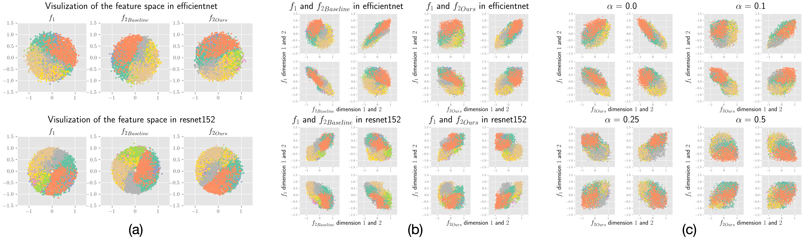
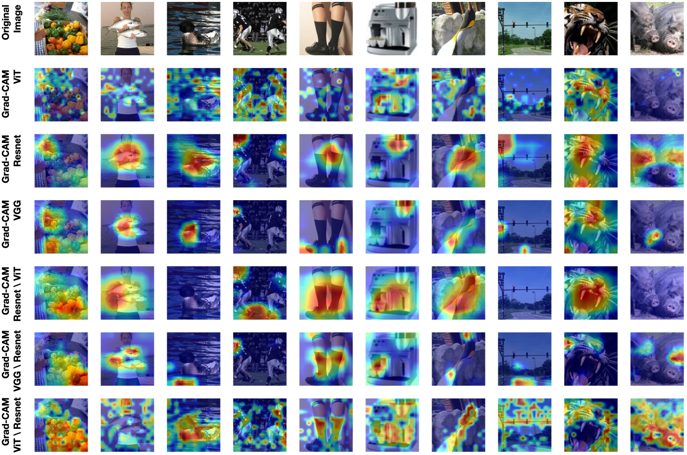

# On the Versatile Uses of Partial Distance Correlation in Deep Learning - Official PyTorch Implementation
> [On the Versatile Uses of Partial Distance Correlation in Deep Learning](https://arxiv.org/abs/2207.09684)  
> Xingjian Zhen, Zihang Meng, Rudrasis Chakraborty, Vikas Singh 
> European Conference on Computer Vision (ECCV), 2022.

# **Update**
- Fixed typo in Partial_Distance_Correlation.ipynb  from Peasor_Correlation() to Pearson_Correlation()
- Reimplementation in TensorFlow in TF_Partial_Distance_Correlation.ipynb

> **Abstract:** Comparing the functional behavior of neural network models, whether it is a single network over time or two (or more networks) during or post-training, is an essential step in understanding what they are learning (and what they are not), and for identifying strategies for regularization or efficiency improvements. Despite recent progress, e.g., comparing vision transformers to CNNs, systematic comparison of function, especially across different networks, remains difficult and is often carried out layer by layer. Approaches such as canonical correlation analysis (CCA) are applicable in principle, but have been sparingly used so far. In this paper, we revisit a (less widely known) from statistics, called distance correlation (and its partial variant), designed to evaluate correlation between feature spaces of different dimensions. We describe the steps necessary to carry out its deployment for large scale models -- this opens the door to a surprising array of applications ranging from conditioning one deep model w.r.t. another, learning disentangled representations as well as optimizing diverse models that would directly be more robust to adversarial attacks. Our experiments suggest a versatile regularizer (or constraint) with many advantages, which avoids some of the common difficulties one faces in such analyses. 

<a href="https://arxiv.org/abs/2207.09684" target="_blank"></a>

[](https://www.youtube.com/watch?v=F7MSjx7FVZg)

Please also go check the [project webpage](https://zhenxingjian.github.io/DC_webpage/)

## Results

### Independent Features Help Robustness (Diverge Training)

Table 1: The test accuracy (%) of a model $f_2$ on the adversarial examples generated using $f_1$ with the same architecture. "Baseline": train without constraint. "Ours": $f_2$ is independent to $f_1$. "Clean": test accuracy without adversarial examples.

| Dataset | Network | Method | Clean | FGM $\epsilon=0.03$ | PGD $\epsilon=0.03$ | FGM $\epsilon=0.05$ | PGD $\epsilon=0.05$ | FGM $\epsilon=0.10$ | PGD $\epsilon=0.10$ |
|:---:|:---:|:---:|:---:|:---:|:---:|:---:|:---:|:---:|:---:|
| CIFAR10 | Resnet 18 | Baseline | 89.14 | 72.10 | 66.34 | 62.00 | 49.42 | 48.23 | 27.41 |
| CIFAR10 | Resnet 18 | Ours     | 87.61 | **74.76** | **72.85** | **65.56** | **59.33** | **50.24** | **36.11** |
| ImageNet |  Mobilenet-v3-small |  Baseline  | 47.16    | 29.64     | 30.00    | 23.52       | 24.81      | 13.90  | 17.15 |
| ImageNet |  Mobilenet-v3-small |  Ours  | 42.34     | **34.47**     | **36.98**    | **29.53**       | **33.77**   | **19.53** | **28.04** |
| ImageNet | Efficientnet-B0 |  Baseline | 57.85  | 26.72  | 28.22  | 18.96 | 19.45 | 12.04 | 11.17 |
| ImageNet | Efficientnet-B0 |  Ours  | 55.82   | **30.42**   | **35.99**  | **22.05** | **27.56** | **14.16** | **17.62** |
| ImageNet |  Resnet 34 |  Baseline  | 64.01     | 52.62     | 56.61    | 45.45       | 51.11       | 33.75 | 41.70 |
| ImageNet |  Resnet 34 |  Ours  | 63.77     | **53.19**     | **57.18**   | **46.50**   | **52.28**   | **35.00** | **43.35** |
| ImageNet | Resnet 152 |  Baseline  | 66.88  | 56.56     | 59.19    | 50.61       | 53.49     | 40.50 | 44.49 |
| ImageNet | Resnet 152 |  Ours  | 68.04  | **58.34**    | **61.33**    | **52.59**      | **56.05**    | **42.61** | **47.17** |



### Informative Comparisons between Networks (Partial Distance Correlation)

Table 2: Partial DC between the network $\Theta_X$ conditioned on the network $\Theta_Y$ , and the ImageNet class name embedding. The higher value indicates the more information.

| Network $\Theta_X$ |  Network $\Theta_Y$ | $\mathcal{R}^2(X, GT)$ | $\mathcal{R}^2(Y, GT)$ | $\mathcal{R}^2(X\|Y, GT)$ | $\mathcal{R}^2((Y\|X), GT)$ |
|:---:|:---:|:---:|:---:|:---:|:---:|
| ViT$^1$     |  Resnet 18$^2$   |  0.042     |  0.025    |  0.035       |  0.007 |
| ViT         |  Resnet 50$^3$   |  0.043     |  0.036    |  0.028       |  0.017 |
| ViT         |  Resnet 152$^4$  |  0.044     |  0.020    |  0.040       |  0.009 |
| ViT         |  VGG 19 BN$^5$  |  0.042     |  0.037    |  0.026       |  0.015 |
| ViT         |  Densenet121$^6$ |  0.043     |  0.026    |  0.035       |  0.007 |
| ViT large$^7$   |  Resnet 18   |  0.046     |  0.027    |  0.038       |  0.007 |
| ViT large   |  Resnet 50   |  0.046     |  0.037    |  0.031       |  0.016 |
| ViT large   |  Resnet 152  |  0.046     |  0.021    |  0.042       |  0.010 |
| ViT large   |  ViT         |  0.045     |  0.043    |  0.019       |  0.013 |
| ViT+Resnet 50$^8$ |  Resnet 18  |  0.044     |  0.024    |  0.037       |  0.005 |
| Resnet 152  |  Resnet 18   |  0.019     |  0.025    |  0.013       |  0.020 |
| Resnet 152  |  Resnet 50   |  0.021     |  0.037    |  0.003       |  0.030 |
| Resnet 50   |  Resnet 18   |  0.036     |  0.025    |  0.027       |  0.008 |
| Resnet 50   |  VGG 19 BN   |  0.036     |  0.036    |  0.020       |  0.019| 

*Note Accuracy: 1. 84.40%; 2. 69.76%; 3. 79.02%; 4. 82.54%; 5. 74.22%; 6. 75.57%; 7. 85.68%; 8. 84.13%*



### Disentanglement

*Visualization*


*Quantitive measurement (distance correlation between residual and attribute of interest)*

Table 3: DC between residual attributes (R) and attributes of interest, if we use the ground truth CLIP labeled data to measure the attribute of interest. Range from 0 to 1, and smaller is better.

| age vs R. | gender vs R. | ethnicity vs R. | hair color vs R. | beard vs R. | glasses vs R |
|:---:|:---:|:---:|:---:|:---:|:---:|
| 0.0329 | 0.0180 | 0.0222 | 0.0242 | 0.0219 | 0.0255 |

Table 4: DC between residual attributes (R) and attributes of interest, if we use in-model classifier to classify the attribute of interest. Range from 0 to 1, and smaller is better.

| age vs R. | gender vs R. | ethnicity vs R. | hair color vs R. | beard vs R. | glasses vs R |
|:---:|:---:|:---:|:---:|:---:|:---:|
| 0.0430 | 0.0124 | 0.0376 | 0.0259 | 0.0490 | 0.0188 |

## Requirements


## Training
Please refer to each different directory for detailed training steps for each experiment.

## Citation
```
@inproceedings{zhen2022versatile,
  author    = {Zhen, Xingjian and Meng, Zihang and Chakraborty, Rudrasis and Singh, Vikas},
  title     = {On the Versatile Uses of Partial Distance Correlation in Deep Learning},
  booktitle = {Proceedings of the European conference on computer vision (ECCV)},
  year      = {2022}
}
```

If you use distance correlation for disentanglement, please give credit to the following paper: [Measuring the Biases and Effectiveness of Content-Style Disentanglement](https://arxiv.org/abs/2008.12378)  which discusses a nice demonstration of distance correlation helps content style disentanglement. We were not aware of this paper when we wrote the paper last year and thank Sotirios Tsaftaris for communicating his findings with us.
